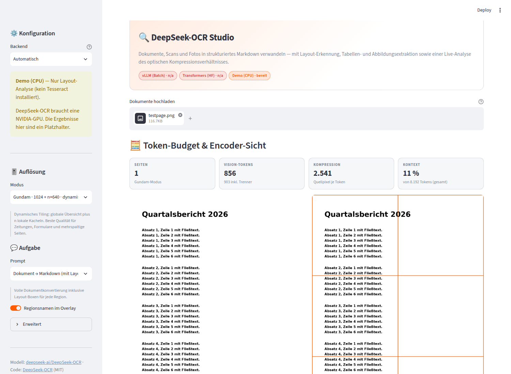
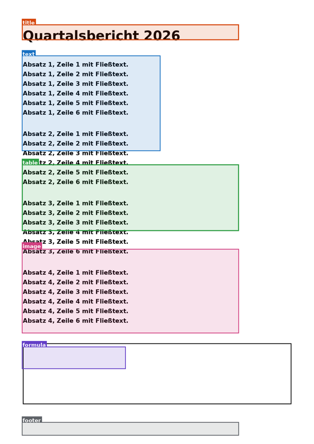

# 🔍 DeepSeek-OCR Studio

Eine Streamlit-Anwendung rund um [**DeepSeek-OCR**](https://github.com/deepseek-ai/DeepSeek-OCR) — dem
Vision-Language-Modell, das eine Dokumentseite in wenige hundert *Vision-Tokens* komprimiert und direkt
als Markdown zurückliest.

Das Upstream-Repo liefert drei Skripte, in denen Pfade und Prompts vor jedem Lauf per Hand in einer
`config.py` editiert werden müssen. Dieses Projekt übernimmt den Kern dieses Codes — Tiling-Mathematik,
Grounding-Format, Sampling-Parameter — und baut daraus eine bedienbare Anwendung: Upload, Layout-Overlay,
Tabellen, Abbildungen, Token-Analyse und Exporte.



---

## Was dazugekommen ist

| Upstream | Hier |
| --- | --- |
| Pfade & Prompts in `config.py` editieren | Upload-Feld, Prompt-Bibliothek, Auflösungswahl im UI |
| Ein Skript pro Eingabetyp (`_image` / `_pdf` / `_eval_batch`) | Eine Pipeline für Bilder, PDFs und Stapel |
| Rechtecke werden direkt aufs Bild gemalt | Getypte `LayoutRegion`-Objekte → Overlay, JSON, Filter, Ausschnitte |
| `eval()` auf Modellausgabe | `ast.literal_eval` + Clamping der Koordinaten |
| Zufallsfarbe pro Region | Feste Farbe pro Regionstyp, mit Legende |
| Tokenanzahl erst nach dem Lauf sichtbar | Token-Budget und Kompressionsrate **vor** dem Lauf |
| Tabellen bleiben rohes HTML | Tabellen als DataFrame + CSV-Export |
| Ausgabe: zwei `.mmd`-Dateien | Markdown, Text, HTML, Layout-JSON, CSVs, Abbildungen, ZIP |
| Ohne GPU nicht startbar | CPU-Fallback, damit UI und Tests überall laufen |
| Keine Tests | 139 Tests, CI über Python 3.10–3.12 |

### Token-Budget vor dem Lauf

Die Kennzahl aus dem Paper — *optische Kompression* — wird zur Bedienhilfe. Für jede Seite wird vorab
berechnet, welches Kachelraster der Encoder wählt und was das kostet:

- **Vision-Tokens** — die reinen Bild-Queries (die im Paper genannten 64 / 100 / 256 / 400).
- **Sequenz-Tokens** — inklusive der Zeilentrenner, die `tokenize_with_images` einfügt. Das ist der
  tatsächliche Platz im Kontextfenster, und er liegt merklich höher.
- **Kompression** — Quellpixel je Vision-Token.

Daneben steht die *Encoder-Sicht*: das Originalbild mit eingezeichnetem Kachelraster. Damit wird die Wahl
des Auflösungsmodus überprüfbar statt geraten.

### Layout-Grounding

Mit einem `<|grounding|>`-Prompt liefert das Modell zu jeder Region eine Bounding-Box. Daraus entstehen
Overlay, Regionsfilter, Abbildungs-Ausschnitte und das Layout-JSON:



---

## Installation

### Ohne GPU — UI, Tests, Entwicklung

```bash
pip install -r requirements.txt
streamlit run app.py
```

Die App startet und ist vollständig bedienbar. Da DeepSeek-OCR CUDA benötigt, greift ein
**CPU-Fallback**, der Ausgaben im exakt gleichen Grounding-Format erzeugt — so laufen UI und Pipeline
überall. Ergebnisse aus diesem Modus sind an jeder Stelle als synthetisch gekennzeichnet: in der
Seitenleiste, über dem Ergebnis, im JSON (`"synthetic": true`) und in der README des ZIP-Exports.
Ist `tesseract-ocr` installiert, liest der Fallback echten Text; ohne Tesseract erkennt er nur Regionen.

### Mit GPU — echtes DeepSeek-OCR

Benötigt eine NVIDIA-GPU. Referenzumgebung des Upstream-Repos: CUDA 11.8, PyTorch 2.6.0.

```bash
pip install -r requirements.txt
pip install torch==2.6.0 torchvision==0.21.0 --index-url https://download.pytorch.org/whl/cu118
pip install -r requirements-gpu.txt

# Optional, ~2x schneller:
pip install flash-attn==2.7.3 --no-build-isolation

# Optional: vLLM-Backend für echtes Batching über viele Seiten
pip install "vllm>=0.11.1"

streamlit run app.py
```

Die Gewichte (`deepseek-ai/DeepSeek-OCR`, ~6,7 GB) werden beim ersten Lauf von Hugging Face geladen.

### Docker

```bash
docker build -t deepseek-ocr-studio .
docker run --gpus all -p 8501:8501 -v deepseek-models:/models deepseek-ocr-studio
```

Das Volume auf `/models` verhindert, dass die Gewichte bei jedem Containerstart erneut geladen werden.

---

## Backends

Das Backend wird automatisch gewählt — vLLM, sonst Transformers, sonst Demo. Die Seitenleiste zeigt
jederzeit an, was verfügbar ist und warum nicht.

| Backend | Wofür | Voraussetzung |
| --- | --- | --- |
| **vLLM** | Viele Seiten. Plant alle Seiten in einem `generate`-Aufruf. | `vllm>=0.11.1`, CUDA |
| **Transformers** | Einzelne Seiten, einfachere Installation. | `torch`, `transformers`, CUDA |
| **Demo (CPU)** | UI-Entwicklung, CI, Tests. Ergebnisse sind synthetisch. | — |

Ein eigenes Backend ergänzen heißt: `OcrEngine` ableiten, `probe()` und `infer()` implementieren, in
`ENGINES` eintragen. Alles danach — Postprocessing, Overlay, Exporte — funktioniert unverändert.

---

## Auflösungsmodi

Aus dem Paper übernommen, mit den Token-Kosten, die die App vorab ausrechnet:

| Modus | Global | Kacheln | Vision-Tokens | Wofür |
| --- | --- | --- | --- | --- |
| Tiny | 512 px | — | 64 | Screenshots, textarme Bilder |
| Small | 640 px | — | 100 | einspaltige Dokumente |
| Base | 1024 px | — | 256 | gescannte A4-Seiten |
| Large | 1280 px | — | 400 | kleine Schrift, dichte Layouts |
| **Gundam** | 1024 px | n × 640 px | 256 + n·100 | Zeitungen, Formulare, mehrspaltig |

Gundam ist die Voreinstellung. Bilder, die bereits in 640×640 passen, werden nie gekachelt — das
entspricht dem Verhalten von `tokenize_with_images` im Upstream.

## Prompts

Alle Modi aus dem Upstream-README, direkt wählbar:

| Vorlage | Prompt |
| --- | --- |
| Dokument → Markdown | `<image>\n<\|grounding\|>Convert the document to markdown.` |
| OCR mit Layout | `<image>\n<\|grounding\|>OCR this image.` |
| Free OCR | `<image>\nFree OCR.` |
| Abbildung parsen | `<image>\nParse the figure.` |
| Bild beschreiben | `<image>\nDescribe this image in detail.` |
| Text lokalisieren | `<image>\nLocate <\|ref\|>…<\|/ref\|> in the image.` |
| Eigener Prompt | Freitext (`<image>` wird ergänzt, falls es fehlt) |

---

## CLI

Für Cronjobs und Pipelines — dieselbe Pipeline, ohne Browser:

```bash
# Backends prüfen
python -m dsocr.cli --list-backends

# Ein Verzeichnis mit Scans verarbeiten
python -m dsocr.cli scans/*.pdf -o out/ --mode gundam --prompt markdown --zip

# Eine Textstelle in einer Rechnung lokalisieren
python -m dsocr.cli rechnung.png --prompt locate --query "Gesamtsumme" -o out/
```

Ergebnis in `out/`: `document.md`, `document.txt`, `layout.json` und pro Seite ein Verzeichnis mit
Rohausgabe, Overlay, Abbildungen und Tabellen-CSVs.

---

## Exporte

| Format | Inhalt |
| --- | --- |
| `document.md` | Markdown, Grounding-Tags entfernt, Abbildungen verlinkt |
| `document.txt` | Reiner Text ohne Markup |
| `document.html` | Eigenständige HTML-Seite (hell/dunkel) |
| `layout.json` | Regionen mit normalisierten *und* Pixel-Boxen, Tabellen, Metriken |
| `*.csv` | Je erkannte Tabelle |
| `*.png` | Ausgeschnittene Abbildungen, Layout-Overlays |
| `*.zip` | Alles zusammen, plus Rohausgabe je Seite |

---

## Architektur

```
app.py                      Streamlit-Einstiegspunkt
dsocr/
├── config.py               Auflösungsmodi, Prompt-Bibliothek, Settings
├── pipeline.py             Orchestrierung: Seiten → Engine → Ergebnis
├── cli.py                  Headless-Batch
├── preprocess/
│   ├── loader.py           Bilder, PDF-Rasterung, EXIF-Korrektur
│   └── tiling.py           Dynamisches Tiling + Token-Rechnung   ← Upstream
├── engines/
│   ├── base.py             OcrEngine-Interface, Request/Result
│   ├── vllm_engine.py      vLLM-Backend mit echtem Batching      ← Upstream
│   ├── transformers_engine.py  HF-Backend                        ← Upstream
│   └── demo_engine.py      CPU-Fallback
├── postprocess/
│   ├── grounding.py        Grounding-Parser, Overlay, Ausschnitte ← Upstream
│   ├── markdown.py         Markdown/Text/HTML, Tabellen
│   └── export.py           Artefakte und ZIP-Paket
└── ui/                     Theme, Seitenleiste, Ergebnisansichten
```

`← Upstream` markiert Module, deren Kernlogik aus dem DeepSeek-OCR-Repo übernommen wurde. Die Herkunft
ist im jeweiligen Modul-Docstring vermerkt, zusammen mit den vorgenommenen Änderungen.

### Konfiguration per Umgebungsvariablen

| Variable | Standard | Wirkung |
| --- | --- | --- |
| `DSOCR_MODEL_PATH` | `deepseek-ai/DeepSeek-OCR` | Modellpfad oder HF-Repo |
| `DSOCR_BACKEND` | `auto` | `vllm` \| `transformers` \| `demo` erzwingen |
| `DSOCR_MIN_CROPS` / `DSOCR_MAX_CROPS` | `2` / `6` | Kachelbudget (bei knappem VRAM senken) |
| `DSOCR_MAX_NEW_TOKENS` | `8192` | Länge der Ausgabe |
| `DSOCR_GPU_MEM_UTIL` | `0.85` | VRAM-Anteil für vLLM |
| `DSOCR_PDF_DPI` | `144` | PDF-Rasterauflösung |
| `DSOCR_MAX_PAGES` | `100` | Seitenlimit pro PDF |
| `DSOCR_ALLOW_DEMO` | `1` | Auf `0` setzen, damit kein synthetisches Ergebnis entstehen kann |

In Produktion mit echten GPUs ist `DSOCR_ALLOW_DEMO=0` empfehlenswert: dann schlägt ein Lauf
sichtbar fehl, statt still auf den Fallback auszuweichen.

---

## Tests

```bash
python -m pytest tests/ -q     # 139 Tests, ~4 s, keine GPU nötig
```

Abgedeckt sind die Bereiche, in denen stille Fehler teuer sind: Tiling-Geometrie und Token-Rechnung
gegen die Zahlen aus dem Paper, der Grounding-Parser samt fehlerhafter und bösartiger Eingaben,
Markdown-/Tabellen-Verarbeitung, Fehlerbehandlung der Pipeline (eine kaputte Seite darf einen Lauf nicht
versenken) und die Vollständigkeit der Exporte.

---

## Grenzen

- **DeepSeek-OCR braucht CUDA.** Ohne NVIDIA-GPU läuft die App, aber nicht das Modell.
- **Der CPU-Fallback ist kein Ersatz.** Er existiert für UI-Entwicklung und Tests.
- **Ein Kontextfenster pro Seite.** Eine dicht bedruckte A3-Seite in Gundam kann 8192 Tokens
  überschreiten; die App warnt vorab und schlägt einen kleineren Modus vor.
- **Tabellenerkennung folgt dem Modell.** Verschmelzt das Modell Zellen falsch, steht das so im CSV.
- **Streaming ist noch nicht durchgezogen.** Das Engine-Interface hat einen `on_token`-Callback, die
  Backends liefern die Ausgabe aber am Stück.

---

## Danke & Lizenz

Modell, Paper und der übernommene Referenzcode stammen von **DeepSeek** —
[deepseek-ai/DeepSeek-OCR](https://github.com/deepseek-ai/DeepSeek-OCR) (MIT).
Dieses Projekt steht ebenfalls unter der MIT-Lizenz.

Zitat des Papers siehe [`DeepSeek_OCR_paper.pdf`](https://github.com/deepseek-ai/DeepSeek-OCR) im
Upstream-Repo.
